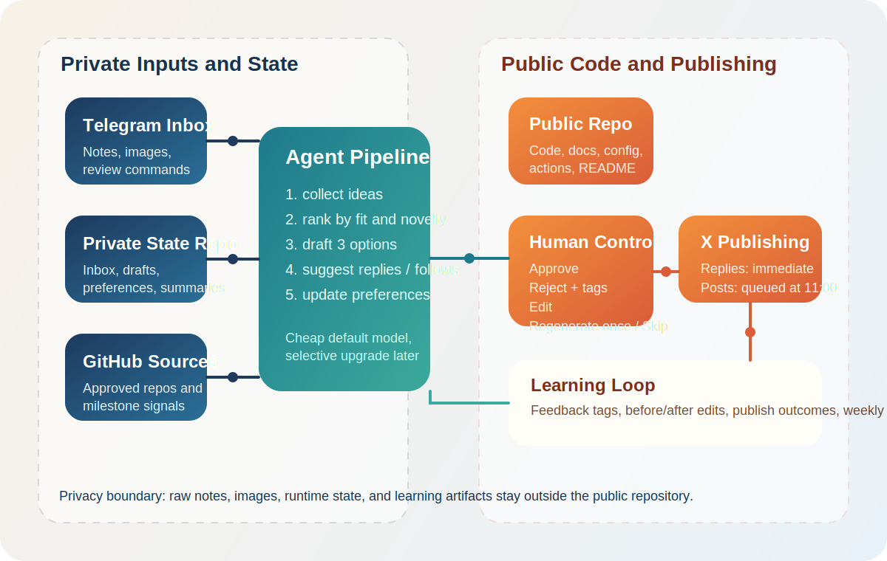

# Social Agent

`social-agent` is a low-cost workflow for running an AI-assisted X account with strong human approval and a clear privacy boundary. The public repository contains code, docs, config, and assets only. Private notes, photos, approval history, and learned preferences live in a separate private companion repo.

## What It Does
- Collects private notes and photos from a Telegram inbox.
- Watches an allowlist of your GitHub repos for milestone-worthy updates.
- Ranks candidate ideas and drafts three post options every two days.
- Routes drafts, reply suggestions, and quote-post suggestions to Telegram for approval.
- Publishes approved replies immediately and queues original posts/quote-posts for a late-morning window.
- Learns from approvals, rejections, edits, and outcomes to improve over time.

## Pipeline



## Repository Layout
- `config/`: public YAML configuration for persona, cadence, repo allowlist, and discovery seeds.
- `docs/`: the living implementation plan and decision log.
- `src/social_agent/`: application code.
- `tests/`: unit and integration tests with mocks.
- `assets/`: README visuals such as the pipeline diagram.

## Companion State Repo

This repo expects a separate private GitHub repository to hold runtime state. In GitHub Actions, clone that repo into a private workspace path and point `SOCIAL_AGENT_STATE_DIR` to it.

Recommended state layout:

```text
state/
  inbox/
  ideas/
  drafts/
  approvals/
  publications/
  suggestions/
  summaries/
  preferences/
  runtime/
```

## Required Secrets
- `OPENAI_API_KEY`
- `X_API_BEARER_TOKEN`
- `X_API_KEY`
- `X_API_SECRET`
- `X_ACCESS_TOKEN`
- `X_ACCESS_TOKEN_SECRET`
- `TELEGRAM_BOT_TOKEN`
- `TELEGRAM_CHAT_ID`
- `STATE_REPO_TOKEN`
- `STATE_REPO_REF`

## Quick Start
```bash
python3 -m venv .venv
source .venv/bin/activate
pip install -e .
social-agent doctor
python -m unittest discover -s tests
```

## Scheduled Jobs
- `capture-inbox`: poll Telegram and store private inbox items.
- `run-drafts`: every-two-days draft generation and Telegram delivery.
- `publish-queued`: checked every 15 minutes, but only publishes queued originals and quote-posts during the configured local `publish_window`.
- `weekly-digests`: engagement digest, follow digest, and weekly summary.

## Publish Timing
- The canonical publish time is `cadence.publish_window` in `config/profile.yaml`, interpreted in `cadence.timezone`.
- The scheduler polls more frequently than the publish window so daylight-saving changes do not silently shift the local publish time.
- Manual `publish-queued --force` runs bypass the time gate for operator testing and recovery.

## Operator Flow
1. Send a note or photo to the Telegram bot.
2. Wait for the scheduled draft batch.
3. Approve, reject, edit, regenerate once, or skip in Telegram.
4. Let the system queue or publish according to the content type.
5. Review the weekly private markdown summary to see what the agent is learning.

## Weekly Engagement Digest
- `reply` suggestions are prompts for posts you may want to reply to manually on X.
- `quote_post` suggestions are prompts for posts you may want to quote-post manually on X.
- The Telegram digest now includes the target handle, direct X post link, and a ready-to-use draft line for each engagement suggestion.
- Engagement suggestions are advisory only; they are not yet routed through the same `/approve` workflow as original draft batches.
